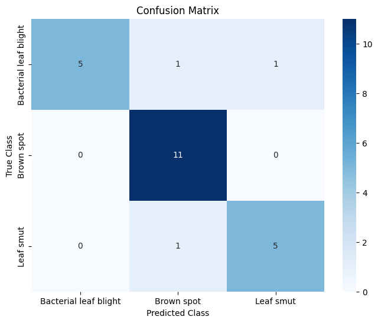
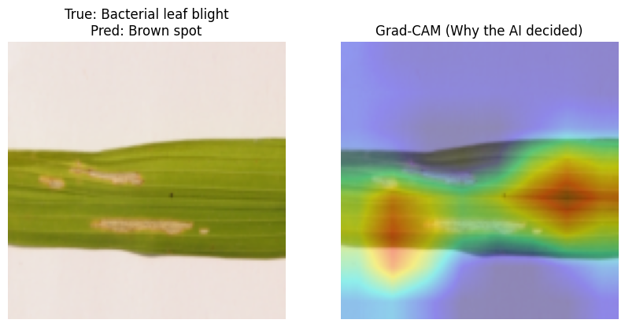

# DeepRice: Explainable AI for Rice Disease Diagnosis

**CSC173 Intelligent Systems Final Project** *Mindanao State University - Iligan Institute of Technology*

**Student:** Hussam M. Bansao, 2022-0484  
**Semester:** AY 2025-2026 Sem 1  

[](https://python.org)
[](https://pytorch.org)
[](LICENSE)

## 📌 Abstract
Rice diseases such as **Bacterial Leaf Blight**, **Brown Spot**, and **Leaf Smut** are major threats to food security in Mindanao. Early diagnosis is critical but often inaccessible. **DeepRice** is a deep learning system powered by **RiceResNet**, a custom Residual Convolutional Neural Network.

Trained on a small, augmented dataset of field images, the model achieves **87.50% Test Accuracy**. Unlike standard "black box" classifiers, this project implements **Explainable AI (XAI)** using **Grad-CAM** (Gradient-weighted Class Activation Mapping), providing visual heatmaps that prove the model identifies specific disease lesions rather than background noise.

---

## 📊 Key Results
| Metric | Result | Notes |
| :--- | :--- | :--- |
| **Accuracy** | **87.50%** | On unseen test data |
| **Brown Spot Recall** | **1.00** | Detected 100% of Brown Spot cases |
| **Blight Precision** | **1.00** | Zero false positives for Bacterial Blight |
| **Training Loss** | **0.015** | Converged using Learning Rate Scheduling |

---

## 🧠 Methodology

### 1. Dataset & Preprocessing
* **Source:** Custom curated dataset (Bacterial leaf blight, Brown spot, Leaf smut).
* **Challenge:** Limited data (~120 images).
* **Solution (Advanced Augmentation):** To prevent overfitting, the training pipeline employs:
    * Random Rotations (±20°)
    * Color Jitter (Brightness/Contrast)
    * Horizontal & Vertical Flips
    * Normalization (ImageNet Standards)

### 2. Architecture: RiceResNet
Instead of a standard CNN, I implemented a **Residual Network** to allow for deeper feature extraction without vanishing gradients.
* **Backbone:** 3 Residual Blocks with Batch Normalization and ReLU.
* **Shortcut Connections:** `x + F(x)` logic to preserve information across layers.
* **Classifier:** Global Average Pooling -> Linear Layer.

### 3. Engineering Features
* **Reproducibility:** Seeded environment (`seed=42`) ensures consistent results.
* **Smart Training:** Implemented `ReduceLROnPlateau` scheduler to dynamically lower the learning rate when validation accuracy plateaus.
* **Explainability:** Integrated **Grad-CAM** hooks to visualize the last convolutional layer's attention.

---

## 📉 Visual Experiments

### Confusion Matrix
The model shows strong diagonal performance.


### Explainability (Grad-CAM)
The heatmap below demonstrates the model's focus. The **red regions** indicate where the neural network "looked" to make its decision. As shown, it focuses strictly on the necrotic lesions on the leaf surface.



---

## 🛠 Installation & Usage

1.  **Clone the Repository**
    ```bash
    git clone [https://github.com/hussammb17/csc173-deepcv-bansao.git](https://github.com/hussammb17/csc173-deepcv-bansao.git)
    cd csc173-deepcv-bansao
    ```

2.  **Install Dependencies**
    ```bash
    pip install -r requirements.txt
    ```

3.  **Run the Training/Inference Notebook**
    Open `CSC173_FinalProj.ipynb` in VS Code or Jupyter Lab and Run All Cells.
    * The dataset is included in the `rice_data/` folder.
    * No external downloads required.

## 🎥 Demo
A full video walkthrough demonstrating the training process and Saliency Map generation can be found in the `demo/` folder.

---

